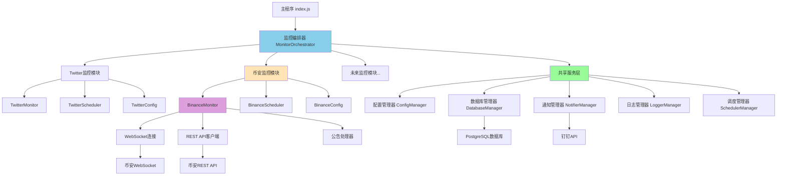
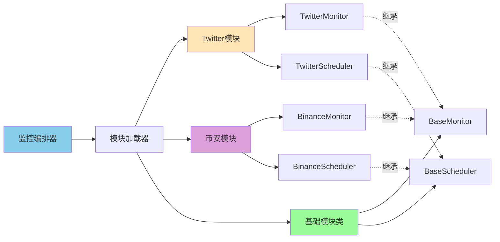
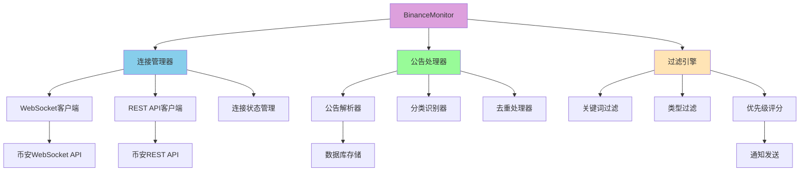

# 多监控源系统设计文档

## 概述

本系统是基于现有Twitter监控系统扩展的多监控源统一监控平台。采用模块化架构设计，支持Twitter、币安公告等多种监控源的独立或组合运行。系统保持环境变量+数据库的混合架构，通过监控编排器统一管理各监控模块，共享通知、数据库、配置等基础设施。

## 系统架构设计

### 整体架构图



### 模块化架构设计



### 币安监控模块架构



## 核心组件设计

### 1. 监控编排器 (MonitorOrchestrator)

**职责**: 统一管理所有监控模块的生命周期和资源分配

**核心功能**:
- 动态加载启用的监控模块
- 管理模块间的资源共享
- 处理模块故障和自动恢复
- 提供统一的监控状态接口

**接口设计**:
```javascript
class MonitorOrchestrator {
    constructor(sharedServices)
    
    // 模块管理
    async loadEnabledMonitors()
    async startAllMonitors()
    async stopAllMonitors()
    async restartMonitor(moduleName)
    
    // 状态管理
    getSystemStatus()
    getModuleStatus(moduleName)
    getSharedServicesStatus()
    
    // 配置管理
    async reloadConfiguration()
    async updateModuleConfig(moduleName, config)
}
```

### 2. 币安监控器 (BinanceMonitor)

**职责**: 实现币安公告的实时监控和数据处理

**核心功能**:
- WebSocket实时连接管理
- REST API轮询备份
- 公告分类和过滤
- 数据去重和存储

**接口设计**:
```javascript
class BinanceMonitor extends BaseMonitor {
    constructor(sharedServices, config)
    
    // 连接管理
    async connectWebSocket()
    async startRestPolling()
    async handleConnectionFailure()
    
    // 数据处理
    async processAnnouncement(announcement)
    async filterAnnouncement(announcement)
    async saveAnnouncement(announcement)
    
    // 通知处理
    async sendNotification(announcements)
    formatNotificationMessage(announcements)
}
```

### 3. 币安调度器 (BinanceScheduler)

**职责**: 管理币安监控的调度策略和时间控制

**核心功能**:
- WebSocket连接保活
- REST API轮询调度
- 错误重试策略
- 性能监控和优化

**接口设计**:
```javascript
class BinanceScheduler extends BaseScheduler {
    constructor(monitor, config)
    
    // 调度管理
    async startScheduling()
    async stopScheduling()
    async adjustScheduleFrequency(frequency)
    
    // 连接管理
    async scheduleWebSocketKeepalive()
    async scheduleRestPolling()
    async handleScheduleFailure(error)
}
```

### 4. 基础监控类 (BaseMonitor)

**职责**: 提供所有监控模块的通用功能和接口规范

**核心功能**:
- 标准化的生命周期管理
- 通用的错误处理机制
- 统一的日志和监控接口
- 共享服务访问接口

**接口设计**:
```javascript
class BaseMonitor {
    constructor(sharedServices, config)
    
    // 生命周期
    async initialize()
    async start()
    async stop()
    async restart()
    
    // 状态管理
    getStatus()
    getStatistics()
    isHealthy()
    
    // 共享服务访问
    getDatabase()
    getNotifier()
    getLogger()
    getConfig()
}
```

## 数据模型设计

### 数据库表结构扩展

```sql
-- 监控模块注册表
CREATE TABLE monitor_modules (
    module_name VARCHAR(50) PRIMARY KEY,
    module_type VARCHAR(20) NOT NULL,
    enabled BOOLEAN DEFAULT true,
    config JSONB,
    status VARCHAR(20) DEFAULT 'stopped',
    last_start_time TIMESTAMP,
    last_stop_time TIMESTAMP,
    created_at TIMESTAMP DEFAULT CURRENT_TIMESTAMP,
    updated_at TIMESTAMP DEFAULT CURRENT_TIMESTAMP
);

-- 币安公告表
CREATE TABLE binance_announcements (
    id SERIAL PRIMARY KEY,
    announcement_id VARCHAR(100) UNIQUE NOT NULL,
    title TEXT NOT NULL,
    content TEXT,
    category VARCHAR(50),
    subcategory VARCHAR(50),
    language VARCHAR(10) DEFAULT 'zh-CN',
    publish_time TIMESTAMP NOT NULL,
    url TEXT,
    tags TEXT[],
    priority_score INTEGER DEFAULT 0,
    processed BOOLEAN DEFAULT FALSE,
    created_at TIMESTAMP DEFAULT CURRENT_TIMESTAMP
);

-- 监控状态表扩展
ALTER TABLE monitor_state ADD COLUMN module_name VARCHAR(50) DEFAULT 'twitter';
ALTER TABLE monitor_state ADD COLUMN last_announcement_id VARCHAR(100);
ALTER TABLE monitor_state ADD COLUMN websocket_status VARCHAR(20);
ALTER TABLE monitor_state ADD COLUMN api_status VARCHAR(20);

-- 通知历史表
CREATE TABLE notification_history (
    id SERIAL PRIMARY KEY,
    module_name VARCHAR(50) NOT NULL,
    notification_type VARCHAR(50) NOT NULL,
    content TEXT NOT NULL,
    recipient VARCHAR(100),
    status VARCHAR(20) DEFAULT 'pending',
    sent_at TIMESTAMP,
    error_message TEXT,
    retry_count INTEGER DEFAULT 0,
    created_at TIMESTAMP DEFAULT CURRENT_TIMESTAMP
);

-- 系统性能指标表
CREATE TABLE system_metrics (
    id SERIAL PRIMARY KEY,
    module_name VARCHAR(50),
    metric_name VARCHAR(50) NOT NULL,
    metric_value DECIMAL(10,2),
    metric_unit VARCHAR(20),
    recorded_at TIMESTAMP DEFAULT CURRENT_TIMESTAMP
);
```

### 配置数据结构

```javascript
// 环境变量配置结构
const environmentConfig = {
    // 系统级配置
    MONITOR_MODULES: 'twitter,binance',
    NODE_ENV: 'production',
    DATABASE_URL: 'postgresql://...',
    DINGTALK_ACCESS_TOKEN: 'token',
    
    // Twitter模块配置
    TWITTER_ENABLED: 'true',
    TWITTER_API_CREDENTIALS: '[...]',
    TWITTER_MONITOR_START_TIME: '09:00',
    TWITTER_MONITOR_END_TIME: '23:00',
    
    // 币安模块配置
    BINANCE_ENABLED: 'true',
    BINANCE_API_KEY: 'api_key',
    BINANCE_API_SECRET: 'api_secret',
    BINANCE_WEBSOCKET_URL: 'wss://stream.binance.com:9443/ws/announcements',
    BINANCE_REST_API_URL: 'https://www.binance.com/bapi/composite/v1/public/cms/article/list/query',
    BINANCE_MONITOR_TYPES: 'new_listing,trading_pair,maintenance',
    BINANCE_KEYWORDS: 'BTC,ETH,USDT,新币上线,交易对',
    BINANCE_CHECK_INTERVAL: '30',
    BINANCE_LANGUAGES: 'zh-CN,en',
    
    // 共享配置
    LOG_LEVEL: 'info',
    MAX_RETRY_ATTEMPTS: '3',
    NOTIFICATION_BATCH_SIZE: '5'
};

// 内部配置对象结构
const internalConfig = {
    system: {
        enabledModules: ['twitter', 'binance'],
        environment: 'production',
        logLevel: 'info'
    },
    
    modules: {
        twitter: {
            enabled: true,
            type: 'social_media',
            config: { /* Twitter特定配置 */ }
        },
        
        binance: {
            enabled: true,
            type: 'crypto_exchange',
            config: {
                apiKey: 'encrypted_key',
                apiSecret: 'encrypted_secret',
                websocketUrl: 'wss://stream.binance.com:9443/ws/announcements',
                restApiUrl: 'https://www.binance.com/bapi/composite/v1/public/cms/article/list/query',
                monitorTypes: ['new_listing', 'trading_pair', 'maintenance'],
                keywords: ['BTC', 'ETH', 'USDT', '新币上线', '交易对'],
                checkInterval: 30,
                languages: ['zh-CN', 'en'],
                maxRetries: 3,
                retryDelay: 5000
            }
        }
    },
    
    shared: {
        database: {
            url: 'postgresql://...',
            poolSize: 10,
            timeout: 30000
        },
        
        notification: {
            dingtalk: {
                accessToken: 'encrypted_token',
                batchSize: 5,
                retryAttempts: 3
            }
        }
    }
};
```

## 币安监控核心算法

### 1. WebSocket连接管理算法

```javascript
class WebSocketConnectionManager {
    constructor(config) {
        this.config = config;
        this.connection = null;
        this.reconnectAttempts = 0;
        this.maxReconnectAttempts = 5;
        this.reconnectDelay = 1000; // 初始延迟1秒
        this.isConnected = false;
        this.heartbeatInterval = null;
    }
    
    async connect() {
        try {
            this.connection = new WebSocket(this.config.websocketUrl);
            
            this.connection.onopen = () => {
                console.log('币安WebSocket连接已建立');
                this.isConnected = true;
                this.reconnectAttempts = 0;
                this.startHeartbeat();
                this.subscribeToAnnouncements();
            };
            
            this.connection.onmessage = (event) => {
                this.handleMessage(JSON.parse(event.data));
            };
            
            this.connection.onclose = () => {
                console.log('币安WebSocket连接已关闭');
                this.isConnected = false;
                this.stopHeartbeat();
                this.handleReconnect();
            };
            
            this.connection.onerror = (error) => {
                console.error('币安WebSocket连接错误:', error);
                this.handleConnectionError(error);
            };
            
        } catch (error) {
            console.error('创建WebSocket连接失败:', error);
            this.handleReconnect();
        }
    }
    
    async handleReconnect() {
        if (this.reconnectAttempts >= this.maxReconnectAttempts) {
            console.error('WebSocket重连次数超限，切换到REST API轮询模式');
            this.switchToRestPolling();
            return;
        }
        
        this.reconnectAttempts++;
        const delay = this.reconnectDelay * Math.pow(2, this.reconnectAttempts - 1);
        
        console.log(`${delay}ms后尝试第${this.reconnectAttempts}次重连`);
        setTimeout(() => this.connect(), delay);
    }
    
    startHeartbeat() {
        this.heartbeatInterval = setInterval(() => {
            if (this.isConnected) {
                this.connection.ping();
            }
        }, 30000); // 每30秒发送心跳
    }
    
    stopHeartbeat() {
        if (this.heartbeatInterval) {
            clearInterval(this.heartbeatInterval);
            this.heartbeatInterval = null;
        }
    }
}
```

### 2. 公告分类算法

```javascript
class AnnouncementClassifier {
    constructor() {
        this.categoryRules = {
            'new_listing': {
                keywords: ['新币上线', 'new listing', 'will list', '上线'],
                titlePatterns: [/新增.*交易对/, /.*will list.*/, /上线.*币种/],
                priority: 10
            },
            
            'trading_pair': {
                keywords: ['交易对', 'trading pair', '新增.*对', '下架'],
                titlePatterns: [/新增.*\/.*交易对/, /.*trading pair.*/, /下架.*交易对/],
                priority: 8
            },
            
            'maintenance': {
                keywords: ['维护', 'maintenance', '升级', 'upgrade', '暂停'],
                titlePatterns: [/系统维护/, /.*maintenance.*/, /服务暂停/],
                priority: 6
            },
            
            'activity': {
                keywords: ['活动', 'activity', '空投', 'airdrop', '奖励'],
                titlePatterns: [/活动公告/, /.*activity.*/, /空投.*奖励/],
                priority: 4
            }
        };
    }
    
    classifyAnnouncement(announcement) {
        const title = announcement.title.toLowerCase();
        const content = announcement.content.toLowerCase();
        
        let bestMatch = {
            category: 'general',
            priority: 1,
            confidence: 0
        };
        
        for (const [category, rules] of Object.entries(this.categoryRules)) {
            let confidence = 0;
            
            // 关键词匹配
            for (const keyword of rules.keywords) {
                if (title.includes(keyword.toLowerCase()) || 
                    content.includes(keyword.toLowerCase())) {
                    confidence += 2;
                }
            }
            
            // 标题模式匹配
            for (const pattern of rules.titlePatterns) {
                if (pattern.test(title)) {
                    confidence += 3;
                }
            }
            
            if (confidence > bestMatch.confidence) {
                bestMatch = {
                    category,
                    priority: rules.priority,
                    confidence
                };
            }
        }
        
        return bestMatch;
    }
}
```

### 3. 关键词过滤算法

```javascript
class KeywordFilter {
    constructor(keywords, languages = ['zh-CN', 'en']) {
        this.keywords = keywords.map(k => k.toLowerCase());
        this.languages = languages;
        this.synonyms = this.buildSynonymMap();
    }
    
    buildSynonymMap() {
        return {
            'btc': ['bitcoin', '比特币', 'btc'],
            'eth': ['ethereum', '以太坊', 'eth'],
            'usdt': ['tether', '泰达币', 'usdt'],
            '新币上线': ['new listing', 'will list', '新币', '上线'],
            '交易对': ['trading pair', 'pair', '交易']
        };
    }
    
    shouldProcess(announcement) {
        const title = announcement.title.toLowerCase();
        const content = announcement.content.toLowerCase();
        const text = `${title} ${content}`;
        
        // 检查直接关键词匹配
        for (const keyword of this.keywords) {
            if (text.includes(keyword)) {
                return {
                    shouldProcess: true,
                    matchedKeyword: keyword,
                    matchType: 'direct'
                };
            }
        }
        
        // 检查同义词匹配
        for (const [mainKeyword, synonyms] of Object.entries(this.synonyms)) {
            if (this.keywords.includes(mainKeyword)) {
                for (const synonym of synonyms) {
                    if (text.includes(synonym.toLowerCase())) {
                        return {
                            shouldProcess: true,
                            matchedKeyword: mainKeyword,
                            matchType: 'synonym',
                            matchedSynonym: synonym
                        };
                    }
                }
            }
        }
        
        return {
            shouldProcess: false,
            reason: 'no_keyword_match'
        };
    }
}
```

## 通知系统扩展设计

### 统一通知管理器

```javascript
class UnifiedNotifierManager {
    constructor(config) {
        this.config = config;
        this.notifiers = {
            dingtalk: new DingTalkNotifier(config.dingtalk)
        };
        this.messageFormatters = {
            twitter: new TwitterMessageFormatter(),
            binance: new BinanceMessageFormatter()
        };
    }
    
    async sendNotification(source, data) {
        try {
            const formatter = this.messageFormatters[source];
            const message = formatter.format(data);
            
            // 批量发送优化
            if (Array.isArray(data) && data.length > this.config.batchSize) {
                return await this.sendBatchNotification(source, data);
            }
            
            return await this.notifiers.dingtalk.send(message);
            
        } catch (error) {
            console.error(`发送${source}通知失败:`, error);
            return { success: false, error: error.message };
        }
    }
    
    async sendBatchNotification(source, dataArray) {
        const batches = this.chunkArray(dataArray, this.config.batchSize);
        const results = [];
        
        for (const batch of batches) {
            const formatter = this.messageFormatters[source];
            const message = formatter.formatBatch(batch);
            const result = await this.notifiers.dingtalk.send(message);
            results.push(result);
            
            // 批次间延迟，避免频率限制
            await this.sleep(1000);
        }
        
        return results;
    }
}

class BinanceMessageFormatter {
    format(announcement) {
        const categoryEmojis = {
            'new_listing': '🆕',
            'trading_pair': '💱',
            'maintenance': '🔧',
            'activity': '🎉',
            'general': '📢'
        };
        
        const emoji = categoryEmojis[announcement.category] || '📢';
        const priorityIndicator = announcement.priority >= 8 ? '🔥' : '';
        
        return `${emoji} ${priorityIndicator}币安公告\n\n` +
               `📋 标题: ${announcement.title}\n` +
               `🏷️ 类型: ${announcement.category}\n` +
               `📅 时间: ${this.formatTime(announcement.publishTime)}\n` +
               `🔗 链接: ${announcement.url}\n\n` +
               `📄 内容摘要:\n${this.truncateContent(announcement.content, 200)}`;
    }
    
    formatBatch(announcements) {
        const header = `📊 币安公告汇总 (${announcements.length}条)\n\n`;
        
        const items = announcements.map((ann, index) => 
            `${index + 1}. ${ann.title}\n` +
            `   类型: ${ann.category} | 时间: ${this.formatTime(ann.publishTime)}`
        ).join('\n\n');
        
        return header + items;
    }
    
    formatTime(timestamp) {
        return new Date(timestamp).toLocaleString('zh-CN', {
            timeZone: 'Asia/Shanghai',
            year: 'numeric',
            month: '2-digit',
            day: '2-digit',
            hour: '2-digit',
            minute: '2-digit'
        });
    }
    
    truncateContent(content, maxLength) {
        if (content.length <= maxLength) return content;
        return content.substring(0, maxLength) + '...';
    }
}
```

## 性能优化策略

### 1. 连接池管理

```javascript
class ConnectionPoolManager {
    constructor() {
        this.httpPool = new HttpConnectionPool({
            maxConnections: 10,
            keepAlive: true,
            timeout: 30000
        });
        
        this.dbPool = new DatabaseConnectionPool({
            min: 2,
            max: 10,
            acquireTimeoutMillis: 30000,
            idleTimeoutMillis: 600000
        });
    }
    
    getHttpClient() {
        return this.httpPool.getConnection();
    }
    
    getDatabaseConnection() {
        return this.dbPool.getConnection();
    }
}
```

### 2. 缓存策略

```javascript
class CacheManager {
    constructor() {
        this.memoryCache = new Map();
        this.cacheExpiry = new Map();
        this.maxCacheSize = 1000;
    }
    
    set(key, value, ttl = 300000) { // 默认5分钟TTL
        if (this.memoryCache.size >= this.maxCacheSize) {
            this.evictOldest();
        }
        
        this.memoryCache.set(key, value);
        this.cacheExpiry.set(key, Date.now() + ttl);
    }
    
    get(key) {
        if (!this.memoryCache.has(key)) return null;
        
        if (Date.now() > this.cacheExpiry.get(key)) {
            this.memoryCache.delete(key);
            this.cacheExpiry.delete(key);
            return null;
        }
        
        return this.memoryCache.get(key);
    }
}
```

## 错误处理和监控

### 错误分类和处理策略

1. **网络错误**
   - WebSocket连接断开: 自动重连，超限后切换REST API
   - HTTP请求超时: 指数退避重试
   - DNS解析失败: 切换备用域名

2. **API错误**
   - 认证失败: 检查API密钥，发送告警
   - 限流错误: 动态调整请求频率
   - 数据格式错误: 记录原始数据，跳过处理

3. **系统错误**
   - 内存不足: 清理缓存，降级服务
   - 数据库连接失败: 启用本地缓存
   - 磁盘空间不足: 清理日志文件

### 监控指标

```javascript
const monitoringMetrics = {
    system: {
        uptime: 'system_uptime_seconds',
        memoryUsage: 'memory_usage_bytes',
        cpuUsage: 'cpu_usage_percent'
    },
    
    binance: {
        websocketConnections: 'binance_websocket_connections',
        announcementsProcessed: 'binance_announcements_processed_total',
        apiRequestsPerMinute: 'binance_api_requests_per_minute',
        connectionFailures: 'binance_connection_failures_total'
    },
    
    notifications: {
        sentTotal: 'notifications_sent_total',
        failedTotal: 'notifications_failed_total',
        averageLatency: 'notification_latency_seconds'
    }
};
```

## 部署架构

### Docker容器化配置

```dockerfile
FROM node:18-alpine

WORKDIR /app

# 安装依赖
COPY package*.json ./
RUN npm ci --only=production

# 复制源代码
COPY src/ ./src/
COPY .kiro/ ./.kiro/

# 设置环境变量
ENV NODE_ENV=production
ENV TZ=UTC

# 健康检查
HEALTHCHECK --interval=30s --timeout=10s --start-period=60s --retries=3 \
    CMD curl -f http://localhost:3000/health || exit 1

# 启动应用
CMD ["npm", "start"]
```

### Railway部署配置

```json
{
  "build": {
    "builder": "NIXPACKS"
  },
  "deploy": {
    "startCommand": "npm start",
    "restartPolicyType": "ON_FAILURE",
    "restartPolicyMaxRetries": 3,
    "healthcheckPath": "/health",
    "healthcheckTimeout": 10
  },
  "environments": {
    "production": {
      "variables": {
        "NODE_ENV": "production",
        "MONITOR_MODULES": "twitter,binance"
      }
    }
  }
}
```

这个设计文档涵盖了多监控源系统的完整架构设计，包括模块化架构、币安监控实现、共享服务设计、数据模型、核心算法和部署策略。整个设计保持了高度的模块化和可扩展性，为后续添加更多监控源奠定了坚实的基础。