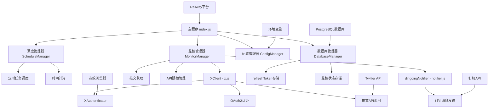
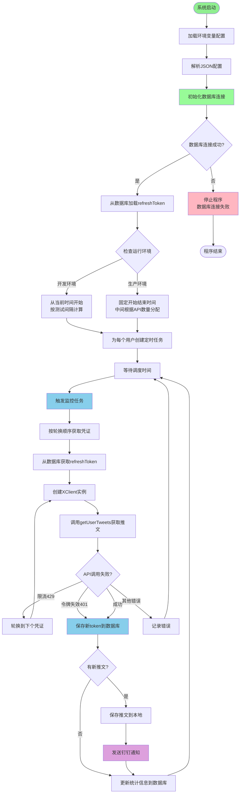
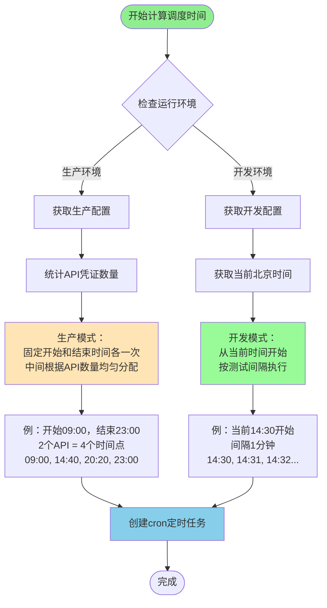
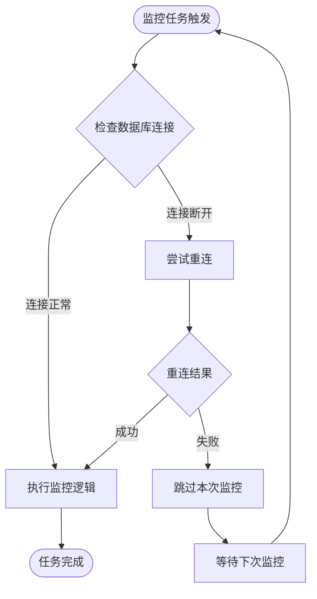

# Twitter多用户监控系统设计文档

## 概述

本系统是一个基于Node.js的Twitter多用户监控系统，采用环境变量+数据库的混合架构，支持多API凭证轮换和智能时间分配。系统使用PostgreSQL存储动态数据，环境变量管理敏感配置，支持开发和生产环境分离，并在Railway平台自动容器化部署。

## 架构设计

### 系统架构图



### 系统工作流程图



### 时间调度算法流程



### 核心组件

#### 1. 调度管理器 (ScheduleManager)
- **职责**: 管理所有用户的监控时间调度
- **功能**: 
  - 根据API凭证数量计算监控时间点
  - 创建和管理定时任务
  - 处理时区转换（北京时间）

#### 2. 监控管理器 (MonitorManager) - 基于现有monitor.js扩展
- **职责**: 执行实际的推文监控任务
- **功能**:
  - 使用现有XClient创建客户端实例
  - 获取用户推文
  - API限额跟踪和凭证轮换
  - 集成时间调度功能

#### 3. X客户端 (XClient) - 现有x.js
- **职责**: Twitter API交互
- **功能**:
  - 推文获取（XClient）
  - 刷新令牌使用
  - API调用管理

#### 4. 钉钉通知 (dingdingNotifier) - 现有notifier.js
- **职责**: 钉钉消息发送
- **功能**:
  - 发送文本消息到钉钉群
  - 格式化消息内容
  - 添加时间戳

#### 5. 预先认证工具 (AuthenticationTool) - 新增
- **职责**: 预先完成API凭证的OAuth认证
- **功能**:
  - 独立的命令行认证工具
  - 自动数据库初始化
  - 批量和单独认证支持
  - 认证状态检查和管理

## 数据模型

### 环境变量配置结构
```bash
# 敏感数据
DINGTALK_ACCESS_TOKEN=钉钉访问令牌
DATABASE_URL=postgresql://用户:密码@主机:端口/数据库名

# API凭证配置（JSON格式）
API_CREDENTIALS='[
  {
    "id": "cred_1",
    "monitorUser": "binancezh",
    "clientId": "客户端ID",
    "clientSecret": "客户端密钥", 
    "redirectUri": "重定向URI",
    "username": "X用户名",
    "browserId": "指纹浏览器ID",
    "proxyUrl": "代理地址"
  }
]'

# 运行模式控制
NODE_ENV=production|development
TEST_MODE=true|false
TEST_INTERVAL=1

# 监控时间配置
MONITOR_START_TIME=09:00
MONITOR_END_TIME=23:00
```


### PostgreSQL数据库表结构
```sql
-- 刷新令牌表
CREATE TABLE refresh_tokens (
    username VARCHAR(50) PRIMARY KEY,
    refresh_token TEXT NOT NULL,
    auth_status VARCHAR(20) DEFAULT 'active',
    auth_time TIMESTAMP DEFAULT CURRENT_TIMESTAMP,
    expires_at TIMESTAMP,
    updated_at TIMESTAMP DEFAULT CURRENT_TIMESTAMP
);

-- 监控状态表（整合了状态和统计信息）
CREATE TABLE monitor_state (
    monitor_user VARCHAR(50) PRIMARY KEY,
    -- 状态信息
    last_tweet_id VARCHAR(50),
    last_check_time TIMESTAMP DEFAULT CURRENT_TIMESTAMP,
    -- 统计信息
    total_tweets INTEGER DEFAULT 0,
    success_count INTEGER DEFAULT 0,
    error_count INTEGER DEFAULT 0,
    rate_limit_hits INTEGER DEFAULT 0,
    last_success_time TIMESTAMP,
    -- 元数据
    created_at TIMESTAMP DEFAULT CURRENT_TIMESTAMP,
    updated_at TIMESTAMP DEFAULT CURRENT_TIMESTAMP
);

-- API使用统计表
CREATE TABLE api_usage_stats (
    credential_id VARCHAR(50) PRIMARY KEY,
    daily_requests INTEGER DEFAULT 0,
    last_request_time TIMESTAMP,
    reset_date DATE DEFAULT CURRENT_DATE,
    created_at TIMESTAMP DEFAULT CURRENT_TIMESTAMP
);
```

### 数据存储结构
```
data/
├── monitor/
│   ├── tweets/
│   │   ├── tweets_2024-01-01.json
│   │   └── tweets_2024-01-02.json
│   ├── stats/
│   │   └── monitor_state.json
│   └── logs/
│       ├── monitor_2024-01-01.log
│       └── auth_2024-01-01.log
└── schedule/
    └── schedule_state.json
```

## 核心算法

### 时间调度算法

```javascript
function calculateScheduleTimes(apiCredentialCount, isProduction = true) {
    const scheduleTimes = [];
    
    if (isProduction) {
        // 生产模式：固定开始和结束时间，中间根据API数量分配
        const startTime = parseTime(process.env.MONITOR_START_TIME || "09:00");
        const endTime = parseTime(process.env.MONITOR_END_TIME || "23:00");
        
        // 固定开始时间
        scheduleTimes.push({ 
            hour: startTime.hour, 
            minute: startTime.minute, 
            credentialIndex: 0 
        });
        
        // 如果有多个API凭证，在中间分配时间点
        if (apiCredentialCount > 1) {
            const totalMinutes = (endTime.hour - startTime.hour) * 60 + (endTime.minute - startTime.minute);
            const intervalMinutes = totalMinutes / (apiCredentialCount - 1);
            
            for (let i = 1; i < apiCredentialCount - 1; i++) {
                const minutesFromStart = startTime.hour * 60 + startTime.minute + (i * intervalMinutes);
                const hour = Math.floor(minutesFromStart / 60);
                const minute = Math.floor(minutesFromStart % 60);
                
                scheduleTimes.push({
                    hour,
                    minute,
                    credentialIndex: i
                });
            }
        }
        
        // 固定结束时间
        if (apiCredentialCount > 1) {
            scheduleTimes.push({ 
                hour: endTime.hour, 
                minute: endTime.minute, 
                credentialIndex: apiCredentialCount - 1 
            });
        }
        
    } else {
        // 开发模式：从当前北京时间开始，按测试间隔执行
        const now = new Date();
        const beijingTime = new Date(now.toLocaleString("en-US", {timeZone: "Asia/Shanghai"}));
        const testInterval = parseInt(process.env.TEST_INTERVAL || "1");
        
        for (let i = 0; i < apiCredentialCount; i++) {
            const testTime = new Date(beijingTime.getTime() + (i * testInterval * 60 * 1000));
            scheduleTimes.push({
                hour: testTime.getHours(),
                minute: testTime.getMinutes(),
                credentialIndex: i
            });
        }
    }
    
    return scheduleTimes;
}

function parseTime(timeStr) {
    const [hour, minute] = timeStr.split(':').map(Number);
    return { hour, minute };
}

// 示例：
// 生产模式 - 2个API，09:00-23:00: [09:00, 23:00]
// 生产模式 - 3个API，09:00-23:00: [09:00, 16:00, 23:00]
// 开发模式 - 当前14:30，间隔1分钟: [14:30, 14:31, 14:32]
```

### 简单凭证轮换算法

```javascript
function getNextCredential(credentials, currentIndex = -1) {
    // 简单的轮换逻辑：按顺序使用下一个凭证
    const nextIndex = (currentIndex + 1) % credentials.length;
    return {
        credential: credentials[nextIndex],
        index: nextIndex
    };
}

function calculateDailySchedule(credentialCount) {
    // 每个凭证每天3次，在8-24点（16小时）内平均分配
    const totalRequests = credentialCount * 3;
    const intervalHours = 16 / totalRequests;
    
    const schedule = [];
    for (let i = 0; i < totalRequests; i++) {
        const hour = 8 + (i * intervalHours);
        schedule.push({
            hour: Math.floor(hour),
            minute: Math.floor((hour % 1) * 60),
            credentialIndex: i % credentialCount
        });
    }
    
    return schedule;
}
```

## 接口设计

### 主要类接口

#### ScheduleManager
```javascript
class ScheduleManager {
    constructor(configManager)
    
    // 初始化所有用户的调度任务
    initializeSchedules()
    
    // 为单个用户创建调度
    createUserSchedule(nickname, apiCredentials)
    
    // 停止所有调度任务
    stopAllSchedules()
    
    // 获取调度状态
    getScheduleStatus()
}
```

#### MonitorManager (扩展现有monitor.js)
```javascript
class MonitorManager {
    constructor(configManager)
    
    // 集成调度功能 - 新增
    initializeScheduledMonitoring()
    
    // 监控单个用户（带凭证选择）- 扩展现有
    monitorUser(nickname, credentialId)
    
    // 获取可用凭证（考虑每日限额）- 扩展现有
    getAvailableCredential(nickname)
    
    // 更新API使用统计 - 新增
    updateApiUsage(credentialId)
    
    // 发送钉钉通知 - 新增
    sendTweetNotification(tweets)
    
    // 处理认证（使用现有XAuthenticator）- 新增
    authenticateCredentialIfNeeded(credential)
}
```

#### AuthenticationTool (新增预先认证工具)
```javascript
class AuthenticationTool {
    constructor()
    
    // 认证所有配置的API凭证
    authenticateAllCredentials()
    
    // 认证指定用户的凭证
    authenticateUserCredentials(nickname)
    
    // 检查所有凭证的认证状态
    checkAuthenticationStatus()
    
    // 重置并重新认证所有凭证
    resetAndReauthenticate()
    
    // 自动初始化数据库表结构
    initializeDatabaseTables()
    
    // 显示认证进度和状态
    displayAuthenticationProgress()
}
```

## 数据库连接管理

### 按需重连机制

系统采用智能的按需重连策略，解决PostgreSQL连接断开导致程序崩溃的问题。

#### 设计原理



#### 核心组件

**DatabaseManager.ensureConnection()**
- 每次监控前检查连接状态
- 快速测试连接可用性
- 连接断开时自动重连
- 重连失败时优雅跳过

**异常处理优化**
- 区分数据库连接错误和其他严重错误
- 连接错误不导致程序退出
- 其他严重错误才触发优雅关闭

#### 技术优势

| 特性 | 定时保活方案 | 按需重连方案 |
|------|-------------|-------------|
| 资源消耗 | 持续查询数据库 | 只在需要时检查 |
| 系统稳定性 | 可能仍有断开风险 | 自然的重连时机 |
| 代码复杂度 | 需要额外定时器 | 集成在业务流程 |
| 数据库负载 | 持续产生负载 | 最小化负载 |

## 错误处理策略

### 错误分类和处理

1. **认证错误**
   - OAuth2认证失败: 记录错误，跳过该凭证
   - 刷新令牌过期: 自动重新认证
   - 指纹浏览器错误: 重试3次后跳过

2. **API错误**
   - 限流错误(429): 立即轮换凭证
   - 认证错误(401): 重新认证凭证
   - 网络错误: 重试3次，指数退避

3. **系统错误**
   - 配置文件错误: 使用默认配置继续运行
   - 存储错误: 记录错误但不中断监控
   - 通知发送失败: 重试3次后记录失败

## 性能优化

### 内存优化
- 使用Map存储活跃客户端，自动清理过期连接
- 限制日志文件大小，定期清理旧日志
- 推文数据按日期分片存储

### 并发控制
- 同一用户的不同凭证串行执行，避免冲突
- 不同用户的监控任务并行执行
- 限制同时活跃的HTTP连接数

### 资源管理
- 定时清理过期的浏览器实例
- 监控内存使用，超过阈值时触发垃圾回收
- 使用连接池管理数据库连接
- **按需重连机制** - 每次监控时检查连接状态，断开时自动重连

## 部署架构

### Railway部署配置
```json
{
  "build": {
    "builder": "NIXPACKS"
  },
  "deploy": {
    "startCommand": "npm start",
    "restartPolicyType": "ON_FAILURE",
    "restartPolicyMaxRetries": 3
  }
}
```

### 环境变量配置
```bash
# Railway部署环境变量
NODE_ENV=production
TZ=Asia/Shanghai
PORT=3000
DINGTALK_ACCESS_TOKEN=钉钉访问令牌
DATABASE_URL=postgresql://用户:密码@主机:端口/数据库名
API_CREDENTIALS=JSON格式的API凭证配置
```

### 数据持久化策略
- 使用Railway的持久化存储卷
- 定期备份关键配置和数据
- 实现优雅关闭，确保数据保存

## 监控和日志

### 日志策略
- 结构化日志，便于查询和分析
- 按级别和模块分类记录
- 定期轮转日志文件

### 健康检查
- HTTP健康检查端点
- 监控关键组件状态
- 异常时发送告警通知

### 性能指标
- API调用成功率
- 平均响应时间
- 内存和CPU使用率
- 推文获取统计